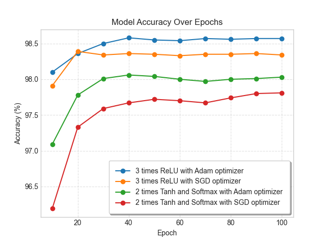

# CustomNeuralNetwork

Manually implementing a neural network from scratch in Python.

## Overview

This project is a custom implementation of a neural network without relying on existing deep learning frameworks like TensorFlow or PyTorch.  
The goal is to understand the fundamentals of neural networks by building each component from the ground up.

## Features

- Custom activation functions: **ReLU, ELU, LeakyReLU, Sigmoid, Tanh, Softmax**  
- Optimizers: **Adam, SGD, RMSProp**  
- Loss functions: **Binary Cross-Entropy, Categorical Cross-Entropy, Mean Squared Error, Mean Absolute Error, Huber Loss**  
- Backpropagation and gradient descent  
- Efficient matrix operations for faster computations  
- Modular design for easy expansion  
- Custom Grid Search class for finding the best accuracy across sample models  

## Training Accuracy

The graph below shows the accuracy of sample models using different optimizers when trained on the MNIST dataset,   
which consists of 28x28 grayscale images of handwritten digits (0-9).



## Usage Example

Below is a simple example of how to create, train, and evaluate a neural network using this implementation.  
The model architecture and optimizer were selected based on the best-performing configuration from the accuracy plot.

```python
from train_model import train
from utils import load_mnist_data, evaluate_model_accuracy

from network.layers import Dense
from network.optimizers import Adam
from network.neural_network import NeuralNetwork
from network.loss_functions import CategoricalCrossEntropy

(X_train, y_train), (X_test, y_test) = load_mnist_data()

model = NeuralNetwork(
                layers=[
                    Dense(neurons=256, activation="ReLU", weight_init="he", dropout=0.8),
                    Dense(neurons=64, activation="ReLU", weight_init="he", dropout=0.8),
                    Dense(neurons=10, activation="ReLU", weight_init="he")
                ],
                loss_function=CategoricalCrossEntropy())

optim = Adam(learning_rate=0.0005, final_learning_rate=0.00005, decay_type="cosine",
                                                beta1=0.9, beta2=0.999, epsilon=1e-7)

train(model, optim, X_train, y_train, X_test, y_test,
      epochs=100, best_epoch_from_grid=40, eval_every=10, batch_size=60)

y_predict = model.predict(X_test)
accuracy = evaluate_model_accuracy(y_predict, y_test)

# Final accuracy of the sample model on test data: 98.58%
print(f"Final accuracy of the sample model on test data: {accuracy:.2f}%")
```

## Notes

Huge appreciation to **Seth Weidman** for his book *Deep Learning from Scratch*.   
His way of explaining neural networks made a huge difference in grasping the fundamentals and helped a lot in building this project from the ground up.

## License
This project is licensed under the MIT License - see the [LICENSE](LICENSE) file for details.
